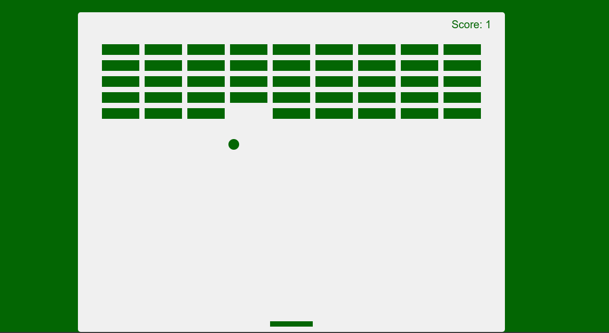

# breakout-game-js
This is just a test to experiment with Github. Nothing original or serious here. It's just couple of code-doodling to familirise myself with git version control environment :-)

## This is what the game looks like 

